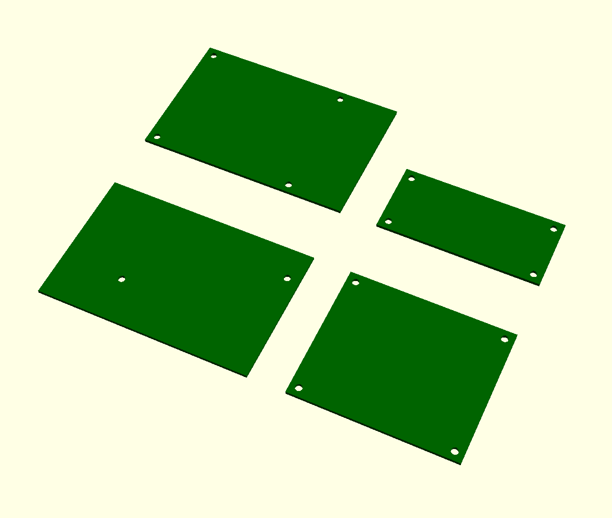

# PiHoles
An [OpenSCAD](http://www.openscad.org) library to assist with designing [Raspberry Pi](https://www.raspberrypi.org) accessories. I wrote this while designing a Pi mount for my 3D printer for use with [OctoPrint](http://octoprint.org), but hopefully you'll find it useful as well.

Currently, PiHoles provides the ability to create mounting holes for Raspberry Pi boards with a preview of where the board would be. In the future I hope to add support for the Pi's various ports.

## Installation
To include PiHoles in your OpenSCAD project, add it to the same directory as your main OpenSCAD file (or a subdirectory such as `/lib` if you prefer). If you're using Git, then you can do `git submodule add https://github.com/daprice/PiHoles.git` to add a [submodule](http://www.git-scm.com/book/en/v2/Git-Tools-Submodules) reference to the library, which makes it easy to keep up to date and for others who use your git repo to get a copy of the library.

PiHole can also be added to your local installation of OpenSCAD per the [User Manual](https://en.wikibooks.org/wiki/OpenSCAD_User_Manual/Libraries), but be sure to tell anyone you share your .scad file with about the dependency.

## Usage
In your own .scad design file, add the line `use <PiHole/PiHoles.scad>` (or whatever relative path you put it in) to include the library, which provides the following capabilities:

### Supported Raspberry Pi versions
PiHoles currently supports versions `"1B"`, `"1A+"`, `"1B+"`, `"2B"`, `"3B"`, and `"Zero"` of the Raspberry Pi. The dimensions used in PiHoles are sourced from the Raspberry Pi Foundation's [offical documentation](https://www.raspberrypi.org/documentation/hardware/raspberrypi/mechanical/) where possible, and based on my own measurements in the case of the 1B.

### Getting dimensions
PiHoles can provide board dimensions and the locations of mounting holes as vectors for use in your own OpenSCAD code.

* `piBoardDim(board)`
	* Returns the x, y, and z dimensions of the board in mm (see above list of supported board strings) in a vector
	* e.g. `piBoardDim("3B")` returns `[85, 56, 1.25]`

* `piHoleLocations(board)`
	* Returns a vector of vectors of the x and y coordinates of the mounting holes for the board
	* e.g. `piHoles("3B")` returns `[[3.5, 3.5], [61.5, 3.5], [3.5, 52.5], [61.5, 52.5]]` (where each sub-vector contains the x and y coordinates of a single mounting hole)

### Modeling the Pi and Holes
PiHoles can also generate the holes and/or board shape for you.

* `piBoard(board)`
	* Generates the basic shape of the Pi circuit board. Currently, this doesn't include any of the ports or anything else that sticks up off the board on either side.

* `piHoles(board, depth, preview)`
	* Generates the shape of the mounting holes for the selected board with the given hole depth in mm. This is intended to be used within a `difference` operation with the object you want to make holes in.
	* The `preview` parameter (optional, default `true`) defines whether or not to show a preview of the board along with the mounting holes, intended to help position the board and model around it. This is only shown in the OpenSCAD "Compile" preview and does not affect the final rendering.
	* The holes are cylinder primitives, so you can optionally set the [special variables](https://en.wikibooks.org/wiki/OpenSCAD_User_Manual/The_OpenSCAD_Language#Special_variables) `$fa`, `$fs`, and `$fn` to define the number of facets.

* `piPosts(board, height, preview)`
	* Generates screwless mounting posts that the pi can snap onto, intended for 3D printing.
	* This is only recommended for Raspberry Pi models that have a minimum of four mounting holes, such as the B+ and later and Zero. Attempting to use the mounting posts with the Pi 1 model B may not result in a good fit.
	* The `height` parameter (optional, default 5) defines the height in mm that the top surface of the Raspberry Pi board should be held up off the base of the mounting posts. The default value of 5 provides the right amount of clearance for everything that sticks out on the bottom of a Raspberry Pi 1B+, 2B, or 3B.
	* The `preview` parameter (optional, default `true`) defines whether or not to show a preview of the board along with the mounting holes, intended to help position the board and model around it. This is only shown in the OpenSCAD "Compile" preview and does not affect the final rendering.

